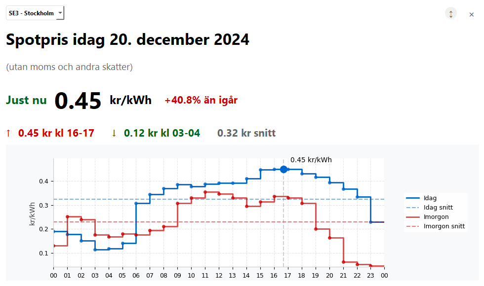

# Electricity Price Widget

A desktop widget displaying real-time electricity prices for different regions in Sweden. The application fetches data from elprisetjustnu.se and shows both current day and next day prices in an interactive graph.



## Features

- Real-time electricity price display with day-over-day price comparison
- Interactive graph showing price trends throughout the day
- Support for all Swedish electricity price regions (SE1-SE4)
- Automatic updates every 15 minutes
- Displays daily price statistics (highest, lowest, average)
- Next day prices (available after 1 PM)
- Draggable, always-on-top widget
- Clean, modern interface with dark theme support
- Expandable view for detailed price analysis

## Getting Started

### Prerequisites

- Python 3.8 or higher
- pip (Python package installer)

### Installation

1. Clone the repository:

```bash
git clone https://github.com/N1klaz/elpriser.git
cd elpriser-widget
```

2. Install required packages:

```bash
pip install -r requirements.txt
```

3. Run the application:

```bash
python main.py
```

## Usage

### Basic Controls

- **Move**: Click and drag anywhere on the widget
- **Expand/Collapse**: Click the ↕️ button or double-click anywhere on the widget
- **Change Region**: Use the dropdown menu in the top-left corner
- **Close**: Click the X in the top-right corner

### Features Explained

- The main display shows the current price and its percentage change compared to yesterday's average
- The graph displays hourly prices with:
  - Blue line: Today's prices
  - Red line: Tomorrow's prices (if available)
  - Dotted lines: Average prices
  - Current time indicator
- Expand the widget to see detailed price trends and statistics

## Technical Details

### Built With

- PyQt6 - GUI framework
- Matplotlib - Graph visualization
- Requests - API communication

### Project Structure

```
elpriser-widget/
├── main.py              # Application entry point
├── components/
│   ├── __init__.py
│   ├── modern_frame.py  # Custom frame widget with shadow effects
│   ├── price_display.py # Main price display widget
│   └── price_graph.py   # Price graph component
├── utils/
│   ├── __init__.py
│   └── api.py          # API client for elprisetjustnu.se
└── requirements.txt    # Project dependencies
```

### Data Source

Price data is fetched from [elprisetjustnu.se](https://www.elprisetjustnu.se)'s public API.

## Contributing

Contributions are welcome! Here's how you can help:

1. Fork the repository
2. Create a feature branch (`git checkout -b feature/YourFeature`)
3. Commit your changes (`git commit -m 'Add YourFeature'`)
4. Push to the branch (`git push origin feature/YourFeature`)
5. Open a Pull Request

### Development Guidelines

- Follow PEP 8 style guide for Python code
- Include docstrings for new functions and classes
- Update documentation for significant changes
- Add comments for complex logic

## License

This project is released as open source without restrictions.

## Acknowledgments

- Data provided by [elprisetjustnu.se](https://www.elprisetjustnu.se)
- Inspired by the need for easy access to electricity price information

---

_Note: This widget is specifically designed for the Swedish electricity market and its pricing regions._
